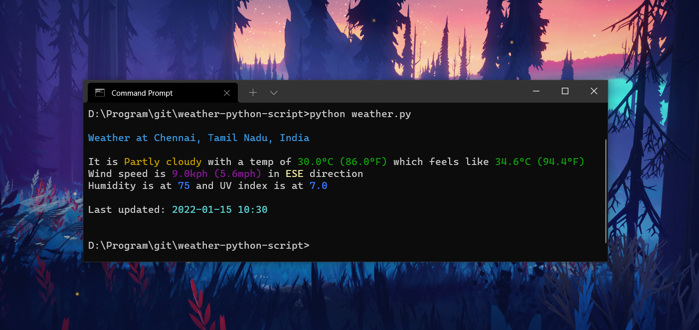

# Weather Script

Simple Weather script written in Python to retrive weather information of the given location.



### Steps to run the script

1. Install the required modules
```
pip install -r requirements.txt
```
2. Get your own API key from [weatherapi.com](https://www.weatherapi.com/) and add it to the `WEATHER_API` in `weather.py`.
```python
WEATHER_API = "Your API key goes here"
```
3. Run the script using -
```
python weather.py
```
#

### Code References
- [nanna7077](https://github.com/nanna7077/LHDBuild22/tree/main/WeatherNow)
